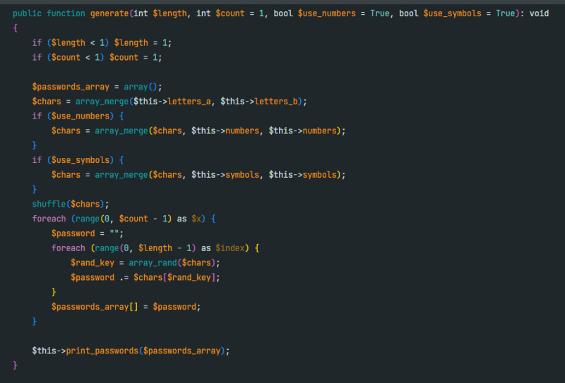

# Краткое описание

Данный репозиторий = пример работы с механизмами ООП на языке PHP. Например, в файлах проекта задействована работа с интерфейсами, активно используются модификаторы доступа для атрибутов (в PHP их чаще называют свойствами) и методов, инкапсуляция, абстракция, реализована возможность вызова цепочки методов (method chaining) у объектов класса Ustring.

Итак, какие классы и API представлены в репозитории?

A\. [Класс PasswordGenerator](https://github.com/sudomango/PHP-OOP-Projects/blob/main/password_generator.php) позволяет сгенерировать набор паролей из случайных символов.

Можно настроить длину каждого пароля, общее количество паролей в наборе, возможность добавления цифр и специальных символов при генерации.

B\. [Класс Ustring](https://github.com/sudomango/PHP-OOP-Projects/blob/main/unicode_string.php) позволяет работать с UTF-8 строками в ООП-стиле.

API этого класса частично спроектирован с оглядкой на стандартную библиотеку Python, в связи с чем всем методам присвоены простые и интуитивно понятные имена.

Реализовано 22 различных метода, так что при желании есть с чем поэкспериментировать.

C\. [Класс CryptoCipher](https://github.com/sudomango/PHP-OOP-Projects/blob/main/crypto_cipher.php) по сути представляет собой мини-библиотеку из трёх отдельных классов, каждый из которых реализует свой алгоритм шифрования. В классе реализованы: классический шифр Цезаря для английского и русского алфавита, модифицированный шифр Цезаря (алфавит генерируется на лету из всех символов в сообщении) и шифр Вернама. Каждый класс имеет методы encode и decode, подробнее см. [в примерах использования](https://github.com/sudomango/PHP-OOP-Projects/blob/main/demo.php) и [в интерфейсах классов](https://github.com/sudomango/PHP-OOP-Projects/blob/main/cipher_interface.php).

## С чего начать знакомство

Демонстрация примеров использования API классов: [скрипт demo.php](https://github.com/sudomango/PHP-OOP-Projects/blob/main/demo.php). Для удобства результат работы скрипта был выведен в отдельный [текстовый файл demo_output.txt](https://github.com/sudomango/PHP-OOP-Projects/blob/main/demo_output.txt), с которым [вы можете легко ознакомиться](https://github.com/sudomango/PHP-OOP-Projects/blob/main/demo_output.txt).

Перечень интерфейсов для ознакомления с реализованными методами:

- [Интерфейс класса PasswordGenerator](https://github.com/sudomango/PHP-OOP-Projects/blob/main/passgen_interface.php)
- [Интерфейс класса Ustring](https://github.com/sudomango/PHP-OOP-Projects/blob/main/ustring_interface.php)
- [Интерфейс набора классов CryptoCipher](https://github.com/sudomango/PHP-OOP-Projects/blob/main/cipher_interface.php)



# Установка и запуск

[Скачайте](https://github.com/sudomango/PHP-OOP-Projects/archive/refs/heads/main.zip) и распакуйте (или просто клонируйте) репозиторий себе на компьютер. После чего запустите скрипт demo.php для просмотра демонстрационного примера.

```shell
php demo.php # Проверено в Windows и Linux (Debian, Ubuntu Server)
```

Вы также можете создать пустой php-скрипт в данном каталоге, или скопировать и подключить php-файлы с готовыми классами к любому своему проекту, и свободно попробовать поработать с API самостоятельно.

Пример подключения готовых классов:

```php
require_once "unicode_string.php";
require_once "crypto_cipher.php";
require_once "password_generator.php";
```

**Примечание:** Автор разрешает использовать и модифицировать исходный код проекта на ваше усмотрение.
